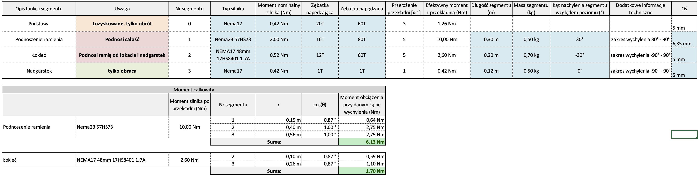
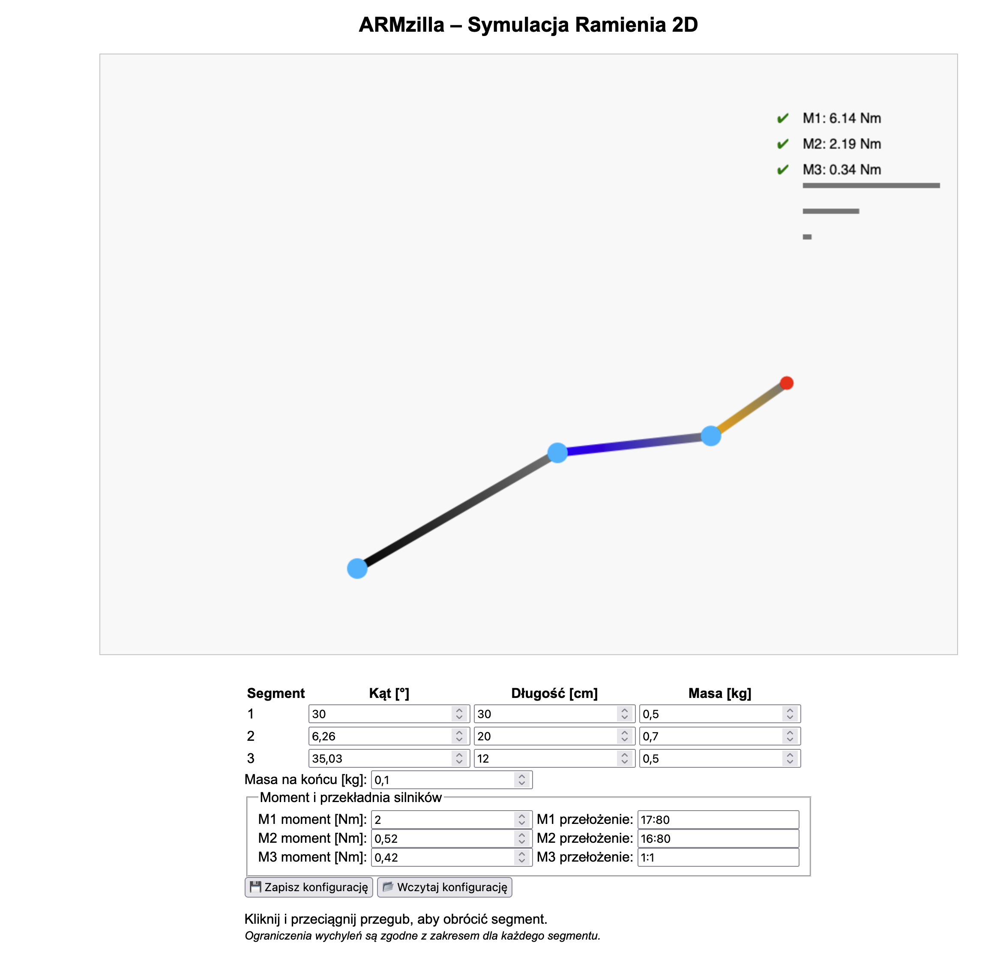

W kolejnym etapie zacząłem zastanawiać się nad tym, z jaką siłą będą musiały mierzyć się poszczególne przeguby ramienia.

Początkowo zakładałem, że wszystkie elementy będą napędzane za pomocą silników **NEMA17** o momencie 0,42 Nm. Przekładnie miały mieć przełożenie 1:3 (koła 20T i 60T, pasek 6 mm), a podstawę zaprojektowałem właśnie pod te wymiary. Wydawało się, że to wystarczy – niezależnie od tego, czy silnik miałby tylko obracać, czy także podnosić segmenty.

Zaczynając projektowanie pierwszego segmentu, pojawiły się jednak wątpliwości. Po pierwsze: **wytrzymałość paska** przy planowanym obciążeniu ~2 kg. Pomyślałem, że przy takim ciężarze pasek 6 mm może się z czasem rozciągać, co wpłynie na precyzję ruchów. Wstępnie rozważałem zmianę na koła pasowe 10 mm i pasek 9 mm.

Kolejny problem był poważniejszy: **czy ten silnik w ogóle da radę podnieść takie ramię**. Zrobiłem więc proste obliczenia momentów – zarówno dla pojedynczych przegubów, jak i całej konstrukcji. Okazało się, że najbardziej obciążony silnik musi unieść praktycznie całe ramię:

Wyniki jednoznacznie wskazały, że NEMA17 to za mało. Wymieniłem więc silnik na **NEMA23 57HS76** (2 Nm) z przekładnią 1:5. Rozważam jeszcze wariant z **57HS52** – ostateczną decyzję podejmę, gdy dokładnie oszacuję wagę gotowego ramienia.

Przy okazji przygotowałem prosty kalkulator:

Dzięki niemu mogę szybko przeliczać momenty, kiedy tylko zmienią się dane – np. długość lub masa segmentów.

🔗 [ARMzilla Kalkulator](https://okyzyr.github.io/ARMzilla/)
