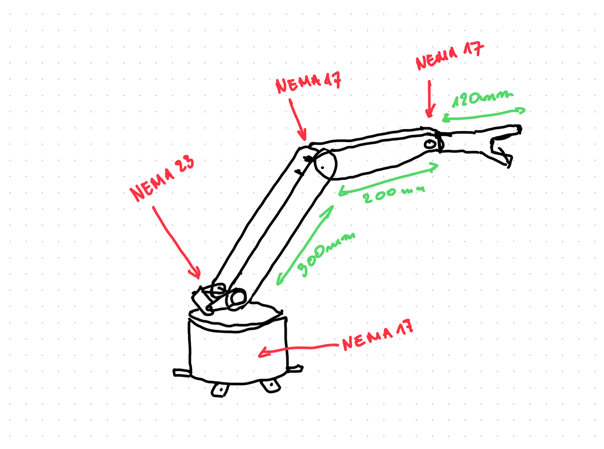
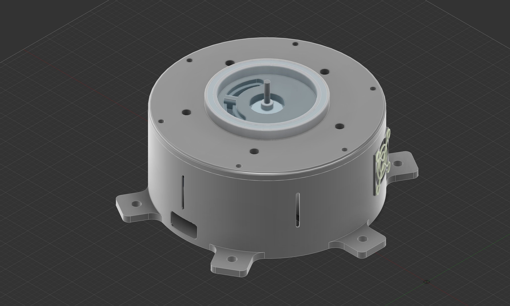
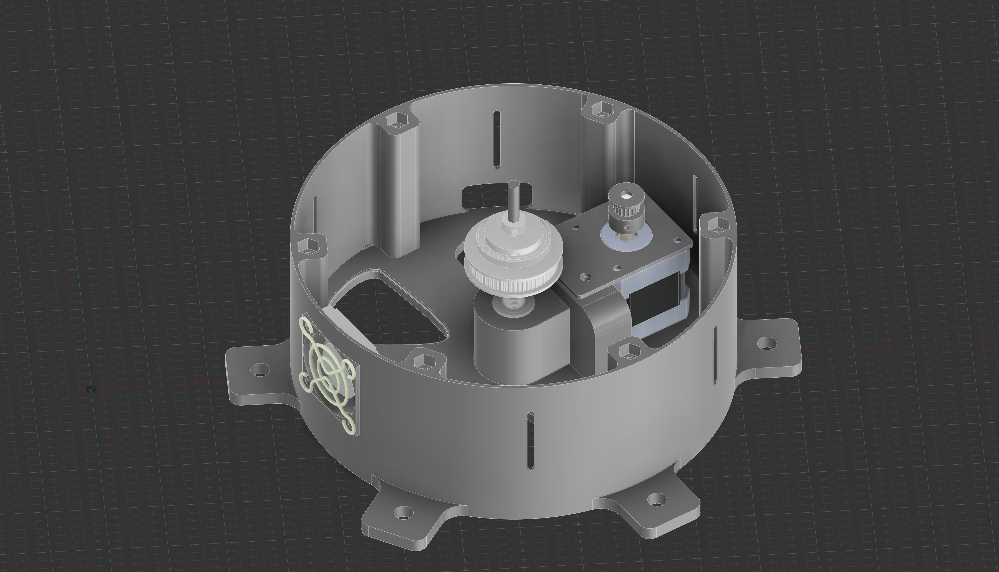
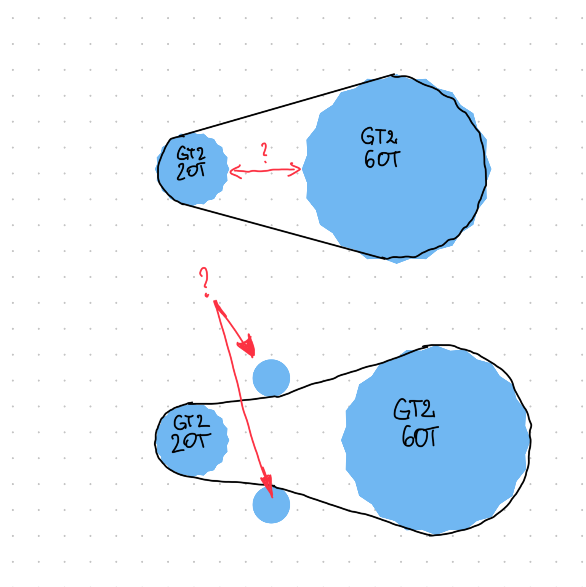
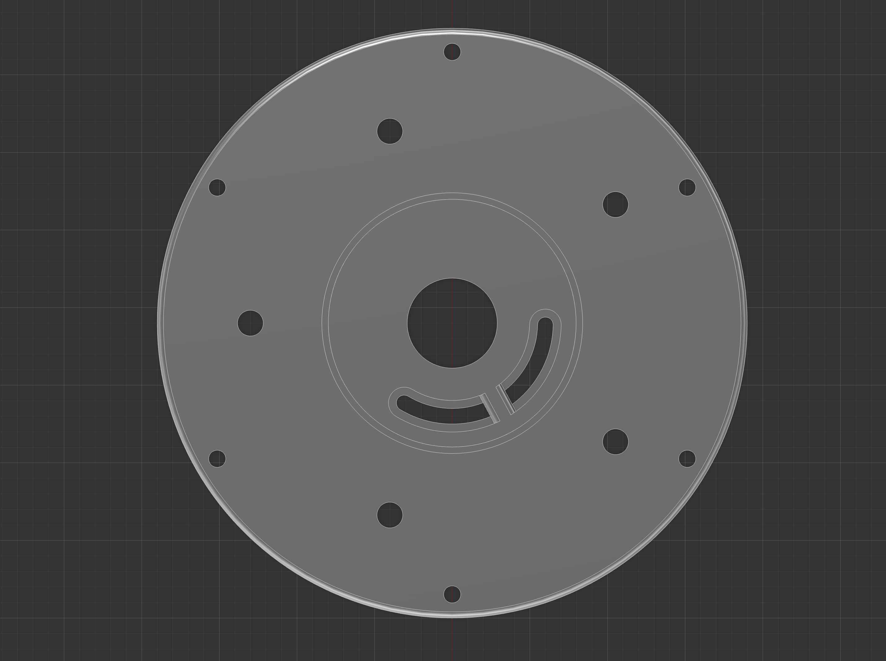
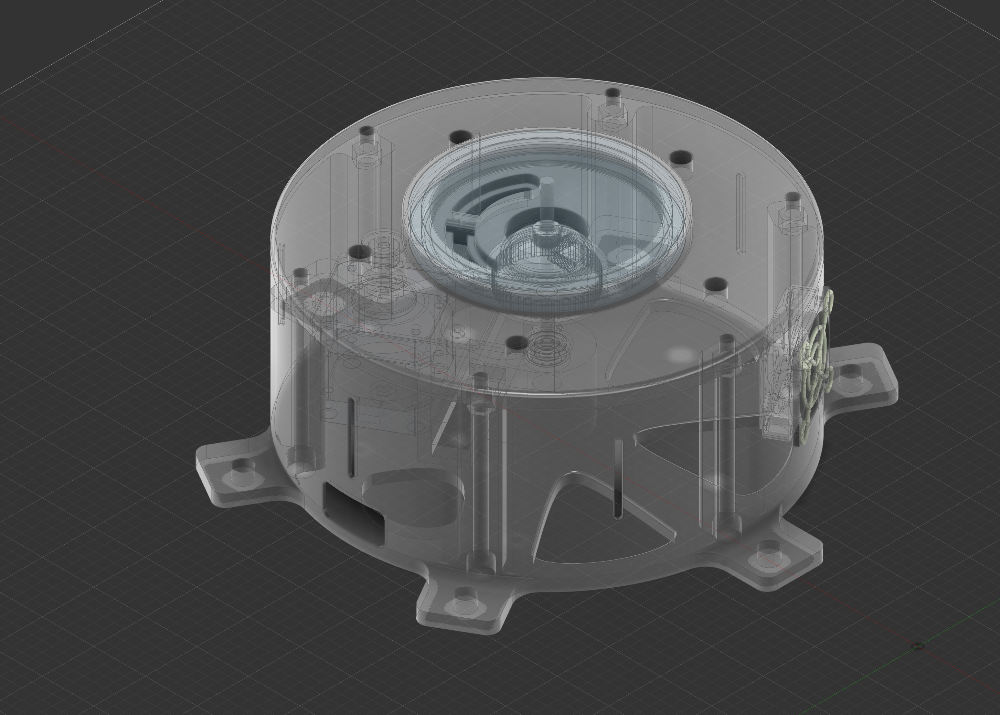
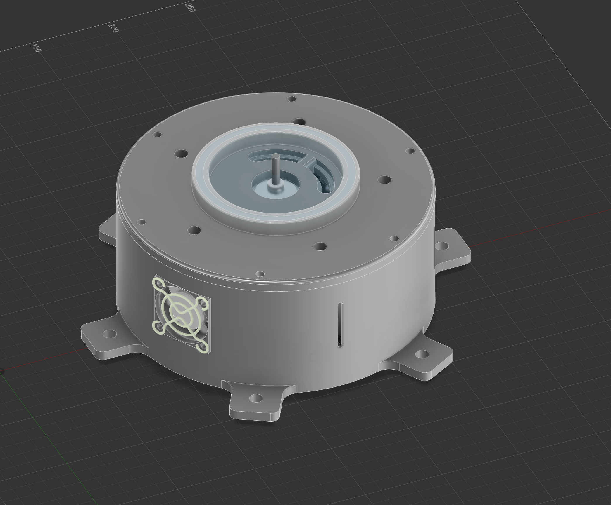
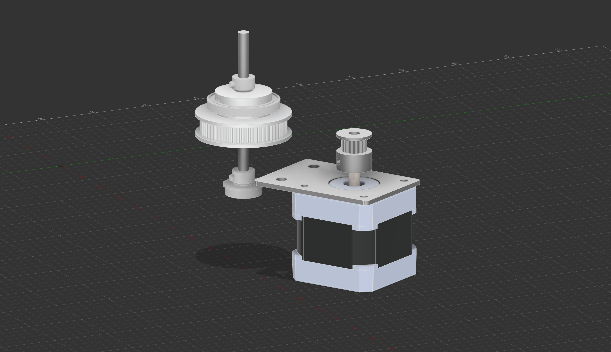

# Pierwsze szkice i fundament ramienia

W ostatnich dniach zrobiłem pierwsze konkretne postępy przy projekcie **ARMzilla**. Choć jeszcze bez żadnych obliczeń, postanowiłem ruszyć z miejscem, od którego wszystko się zacznie — **podstawą ramienia**.

## Wstępna koncepcja konstrukcji

Na papierze naszkicowałem pierwszą wersję całego ramienia. Zasadniczo będzie się ono składało z czterech osi napędzanych silnikami krokowymi oraz końcówki chwytającej poruszanej serwem. Przewiduję użycie:

- **NEMA 23** jako siłownika ramienia głównego (największe obciążenia),
- **NEMA 17** dla pozostałych stopni swobody — także w podstawie,
- chwytaka opartego na serwomechanizmie.

## Podstawa: projekt w Fusion 360

Zacząłem naukę **Fusion 360** i od razu zaprojektowałem pierwszy rzeczywisty element: podstawę ramienia. Ma ona pełnić dwie funkcje:

1. Obudowa i mocowanie silnika krokowego  
2. Stabilna baza pod łożyskowaną konstrukcję obrotową

Wewnątrz umieściłem:

- silnik **NEMA 17 (40 mm, 0.42 Nm)**  
- przekładnię pasową **GT2 20T:60T**  
- pasek **GT2 6 mm**

  

Całość będzie oparta na **łożysku tocznym 100 mm**, na które nałożona zostanie górna część ramienia. Dolna pokrywa oraz obudowa zawierają odpowiednie gniazda na śruby, kanały powietrzne oraz mocowanie napędu.

## Problem z napięciem paska

Jednym z pierwszych problemów projektowych okazał się sposób **napięcia paska zębatego**. Standardowy rozstaw kół GT2 20T i 60T nie daje możliwości regulacji, a bez napięcia zakładam, że pasek przy dużym obciążeniu może ślizgać się po zębatce zamiast obracać koło. 

Ostatecznie zdecydowałem się na zastosowanie **dwóch wolnoobracających się kół**, które będą dociskać pasek od zewnętrznej strony. Aby zapewnić możliwość ich regulacji, zaprojektowałem **otwory podłużne** w pokrywie, przez które koła będą regulowane i blokowane w odpowiedniej pozycji.

To rozwiązanie pozwala na:

- prostą regulację napięcia paska  
- zachowanie zwartej konstrukcji  
- uniknięcie przesuwania osi silnika lub głównego koła  

## Widoki konstrukcji

  
  

## Podsumowanie

Na tym etapie udało się:

- narysować wstępny szkic ramienia i określić orientacyjny rozmiar sekcji  
- wybrać napęd silnika podstawy  
- zaprojektować obudowę i mechanizm napędowy w Autocad Fusion – przy okazji mój pierwszy kontakt z tym programem  
- rozwiązać problem napięcia paska w niestandardowej konfiguracji  

